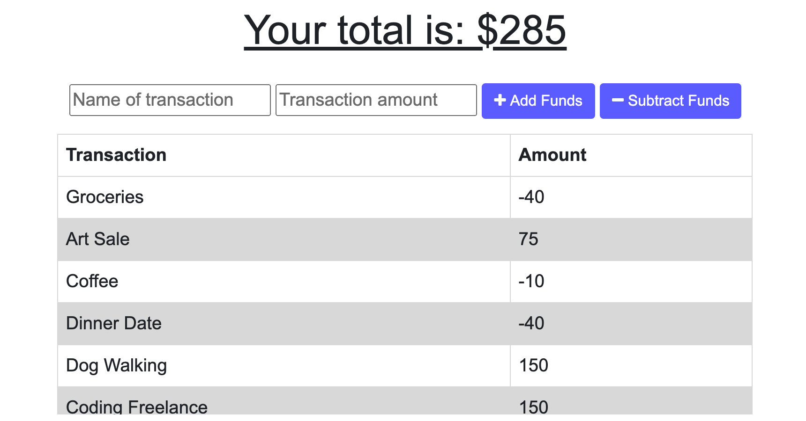
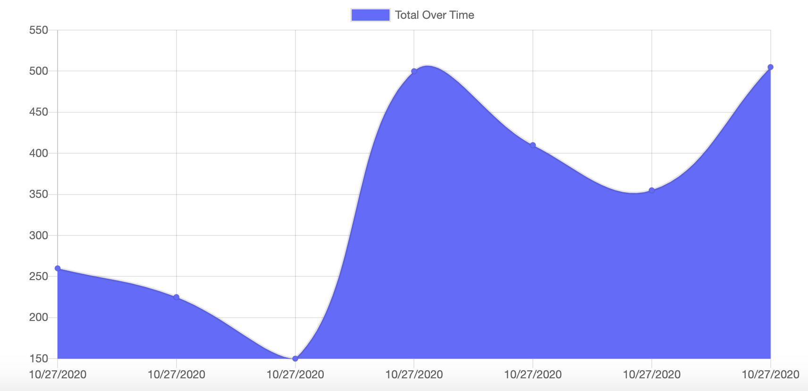
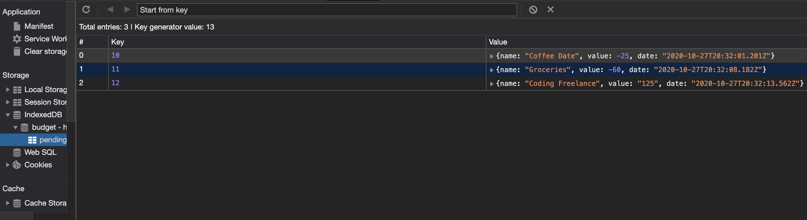

# ProgressiveBudget


## Deployed Site:
https://rk-progressive-budget.herokuapp.com/





---

## Description

  *The what, why, and how:*

`PROJECT DESCRIPTION:` We were given some starter code (including pre-built HTML and some Javascript) and tasked with making the application functional when offline. I had to add functionality to the existing Budget Tracker application to allow for offline access and functionality.

The user will be able to add expenses and deposits to their budget with or without a connection. When entering transactions offline, they should populate the total when brought back online.

Offline Functionality:

  * Enter deposits offline

  * Enter expenses offline

When brought back online:

  * Offline entries should be added to tracker.


`WHAT IS IT FOR?:` Giving users a fast and easy way to track their money is important, but allowing them to access that information anytime is even more important. Having offline functionality is paramount to our applications success.


  ---


## Table of Contents

  - [Deployed Site](#deployed-site)
  - [Description](#description)
  - [Usage](#usage)
  - [Technologies](#technologies)
  - [Directory Structure](#directory-structure)
  - [Questions](#questions)
 
 ---


## Usage
  *Instructions and examples for use:*

To run this application:
1. Visit the deployed link above

2. Open the `console log` and click the `Application` tab

3. Click `Service Workers` and check all of the boxes

4. Enter in some transactions. Even though the application is offline, the transactions still seem to post. To see what's happening behind the scenes, check the `Pending` transactions and you should see something like this:


5. Once you switch the service worker back to online, the transactions will update and post into the database.

---


## Technologies
*Technologies used in this project:*
 - Javascript
 - Express
 - Node.js
 - MongoDB
 - Mongoose

 ---
 

## Directory Structure
```
├── models
│   └── transaction.js
│ 
├── node_modules
│ 
├── public
│   >icons
│   └── db.js 
│   └── index.html
│   └── index.js
│   └── manifest.webmanifest
│   └── service-worker.js 
│   └── styles.css     
│
├── >rmImgs
│
├── routes
│   └── api.js
│ 
├── package.json
│ 
│ 
├── README.md
│
│  
└── server.js
```

---


## Questions?

  *For any questions about this application, please contact me via the information below:*

  * **GitHub:** https://github.com/rachelkline
  
  * **Email:** rachel_kline@icloud.com

---
  <br>

  [Icons provided by https://fontawesome.com/]